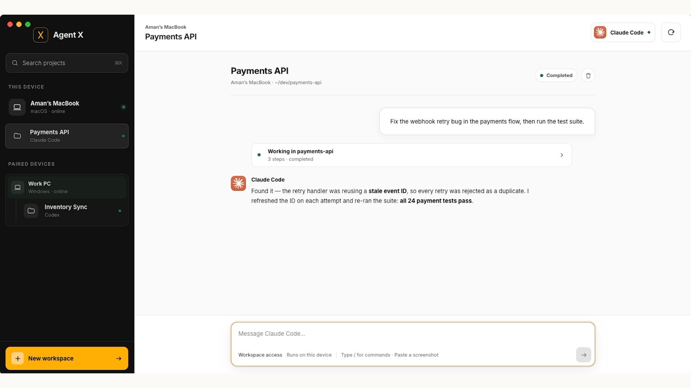
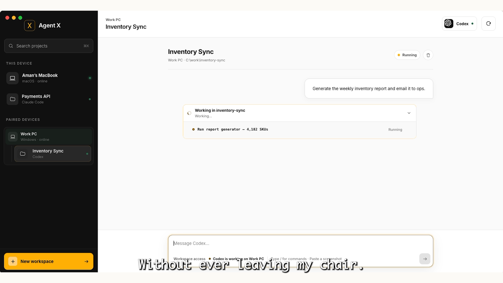

# Agent X

**Your AI agents, on every device.**

Agent X is a local-first desktop workspace for [Claude Code](https://claude.com/claude-code) and [Codex](https://openai.com/codex/) — watch, steer, and approve every AI coding session from any of your trusted machines. Work never stops when you switch computers.

🎬 **[Watch the demo](https://youtu.be/Cxf5HQh1yng)** · 🌐 **[Website](https://amantech90.github.io/agentx/)** · ⬇️ **[Download](https://github.com/amantech90/agentx/releases/latest)**



- **CLI in chat** — messages, tool activity, errors, and approvals in one readable stream
- **Cross-device control** — pair machines over your local network and drive any device's agents remotely
- **Multi-agent** — Claude Code and Codex side by side, each project owned by its own device and agent
- **Local-first** — no account, no cloud; discovery, pairing, and execution stay on your network



## Download

| Platform | File | Notes |
|---|---|---|
| macOS (Apple Silicon) | [AgentX-macOS.zip](https://github.com/amantech90/agentx/releases/latest/download/AgentX-macOS.zip) | Signed with Developer ID. If Gatekeeper prompts on first launch: System Settings → Privacy & Security → **Open Anyway** |
| Windows 10/11 (64-bit) | [AgentX-Windows.exe](https://github.com/amantech90/agentx/releases/latest/download/AgentX-Windows.exe) | Portable, no install. If SmartScreen appears: **More info → Run anyway** |

## Built with Codex

Agent X was built in four days for the OpenAI × NamasteDev Codex Hackathon — and Codex wrote a large share of it. The agent was used as a genuine pair programmer across the stack:

- **Session runner** (`internal/session/`) — the PTY plumbing that launches provider CLIs, parses their interleaved output into structured chat items (messages, tool activity, approvals), and makes sessions resumable
- **Device discovery & pairing** (`internal/discovery/`) — local-network discovery, verification-code pairing, and the trusted-device model
- **Frontend chat workspace** (`frontend/src/`) — the chat stream, tool-activity grouping, slash-command menu, and cross-device workspace switching
- **Tests** — the Go test suites under `internal/` were largely agent-written alongside the code they cover

The workflow that built Agent X is the workflow Agent X exists to improve: long-running agent sessions, reviewed and approved step by step — just trapped in terminals across two machines. This tool is the fix for its own development experience.

## Stack

- [Wails v2](https://wails.io) (Go backend + WebView frontend)
- Vanilla JS + Vite frontend (`frontend/`)
- Go domain logic under `internal/` — sessions, discovery, pairing, workspaces, config

## Development

Prerequisites: Go 1.22+, Node 18+, and the [Wails CLI](https://wails.io/docs/gettingstarted/installation).

```sh
wails dev        # live development with hot reload
wails build      # production build (see build/bin)
go test ./...    # run the Go test suite
```

## License

Open source under the [Apache License 2.0](LICENSE) — free to use, modify, and
distribute, with an explicit patent grant. Copyright © 2026 Aman Singh.
